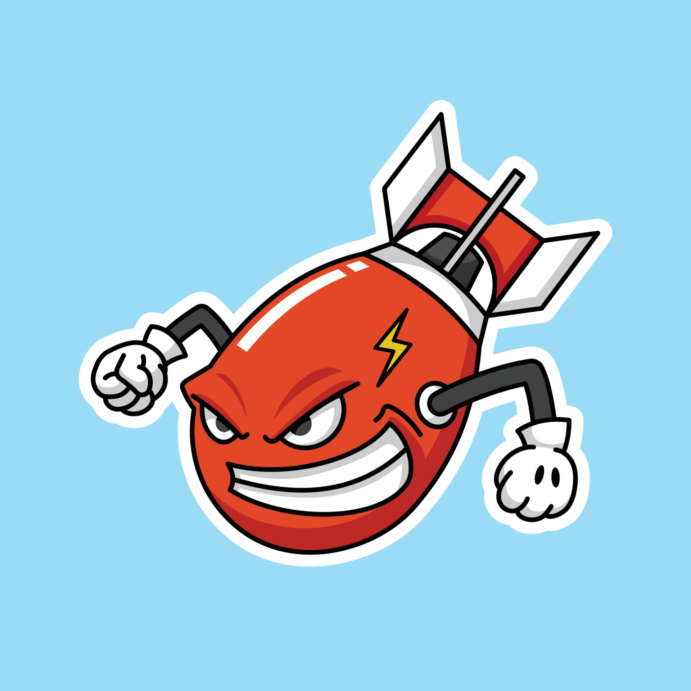

# Fuze

--------

<div>
    
    <h1>Fuze - HTTP router and URL matcher for building Go web apps</h1>
</div>

--------

# Examples

## Default server template

```go
package main

import (
	"fmt"
	"github.com/alserov/fuze"
)

func main() {
	a := fuze.NewApp()

	a.Controller.GET("/path", func(c *fuze.Ctx) {
		fmt.Println("hello!")
	})

	err := a.Run()
	if err != nil {
		panic(err)
	}
}
 ```  